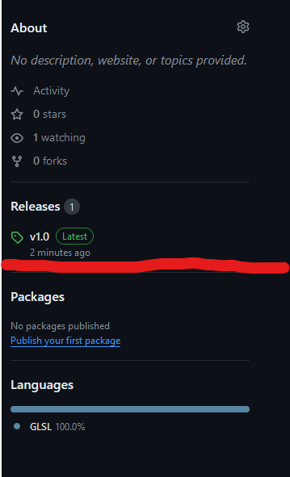
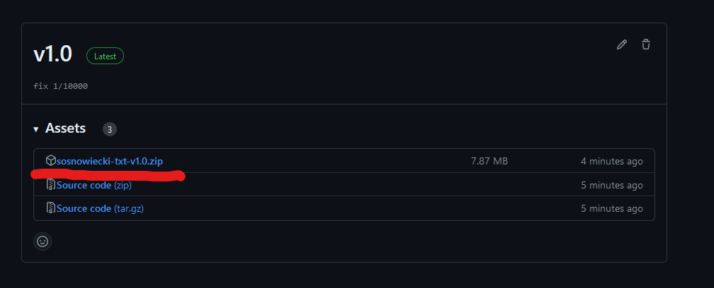

# Sosnowiecki textur pack (serwer chezjusza)

## instrukcja instalacji dla nieporadnych
- Po prawej stronie strony (xd) masz coś takiego jak releases

- wchodzisz w releases i ściągasz najnowszy (jak na rysunku)

- no i bajlando
